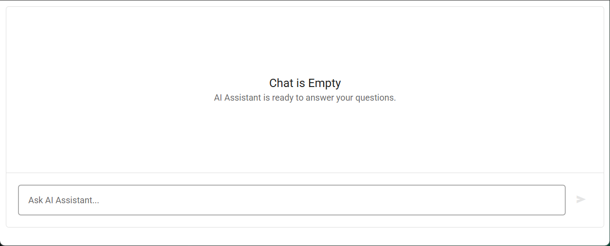

<!-- default badges list -->

[](https://supportcenter.devexpress.com/ticket/details/T1307369)
[](https://docs.devexpress.com/GeneralInformation/403183)
[](#does-this-example-address-your-development-requirementsobjectives)
<!-- default badges end -->
# DevExtreme Chat - Integration with Google Dialogflow

This repository contains code referenced in the following DevExtreme help topic: [Integrate with AI Service - Google Dialogflow](https://js.devexpress.com/Documentation/Guide/UI_Components/Chat/Integrate_with_AI_Service/#Google_Dialogflow).

This example integrates [Google Dialogflow](https://cloud.google.com/dialogflow/docs) into DevExtreme Chat.

<div align="center"></div>

## How to Run the Example

Follow these instructions to run **client** applications available in this repository (jQuery, Angular, Vue, or React). To run the ASP.NET Core example, follow steps 1-3, and then refer to [ASP.NET Core Readme.md](ASP.NET%20Core/Readme.md).

1. Clone the repository and navigate to the example folder.
2. Replace the placeholder in the `key.json` file with your Dialogflow API key.
3. Navigate to the `server` folder, install dependencies, and start the server:
    ```bash
    cd server
    npm install
    npm run start:server
    ```
4. Navigate to the client folder of your preferred framework, install dependencies, and start the client application **while the server is running**:
    ```bash
    cd <framework>
    npm install
    npm run start
    ```

## Files to Review

- **jQuery**
    - [index.js](jQuery/src/index.js)
    - [helpers.js](jQuery/src/helpers.js)
- **Angular**
    - [app.component.html](Angular/src/app/app.component.html)
    - [app.component.ts](Angular/src/app/app.component.ts)
    - [app.service.ts](Angular/src/app/app.service.ts)
- **Vue**
    - [ChatInterface.vue](Vue/src/components/ChatInterface.vue)
    - [chat.helpers.ts](Vue/src/chat.helpers.ts)
- **React**
    - [ChatApp.tsx](React/src/components/ChatApp.tsx)
    - [ChatService.tsx](React/src/ChatService.tsx)
- **NetCore**    
    - [Index.cshtml](ASP.NET%20Core/Views/Home/Index.cshtml)

## Documentation

- [Chat - Getting Started](https://js.devexpress.com/React/Documentation/Guide/UI_Components/Chat/Getting_Started_with_Chat/)
- [Integrate with AI Service - Google Dialogflow](https://js.devexpress.com/Documentation/Guide/UI_Components/Chat/Integrate_with_AI_Service/#Google_Dialogflow)
- [Chat - API](https://js.devexpress.com/React/Documentation/ApiReference/UI_Components/dxChat/)

<!-- feedback -->
## Does This Example Address Your Development Requirements/Objectives?

[](https://www.devexpress.com/support/examples/survey.xml?utm_source=github&utm_campaign=devextreme-chat-google-dialogflow&~~~was_helpful=yes) [](https://www.devexpress.com/support/examples/survey.xml?utm_source=github&utm_campaign=devextreme-chat-google-dialogflow&~~~was_helpful=no)

(you will be redirected to DevExpress.com to submit your response)
<!-- feedback end -->
